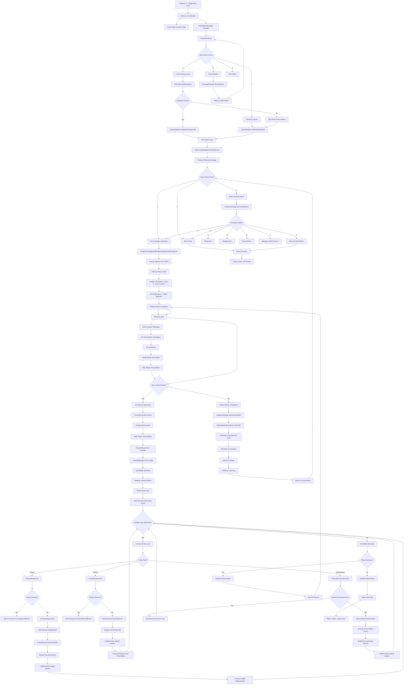
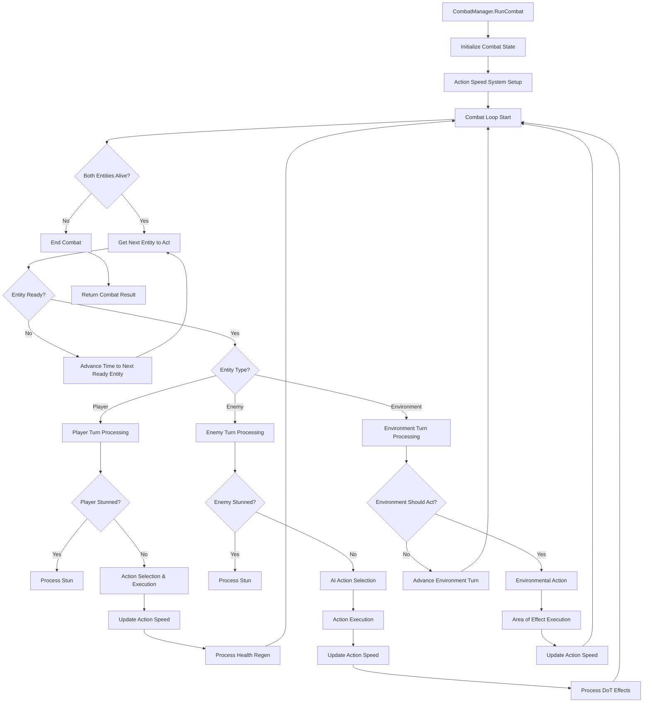
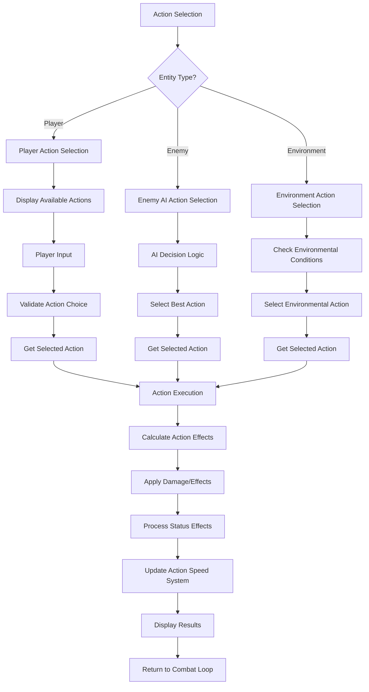
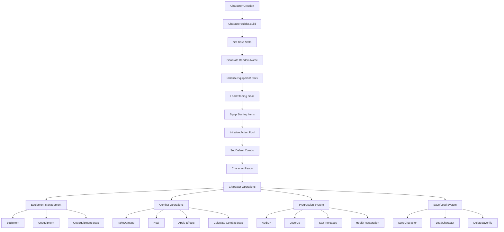
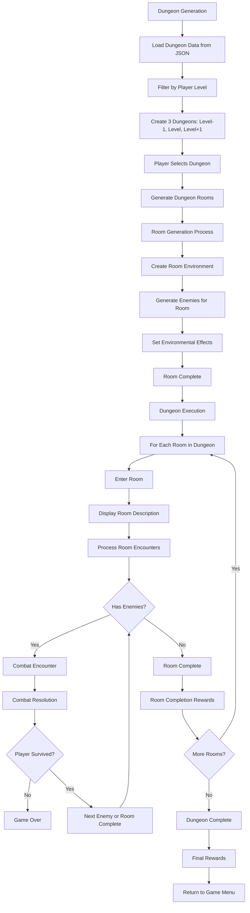
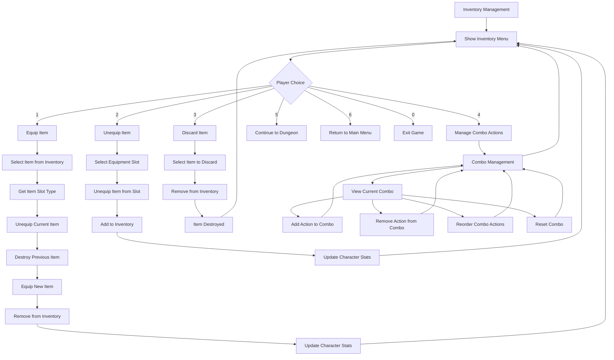
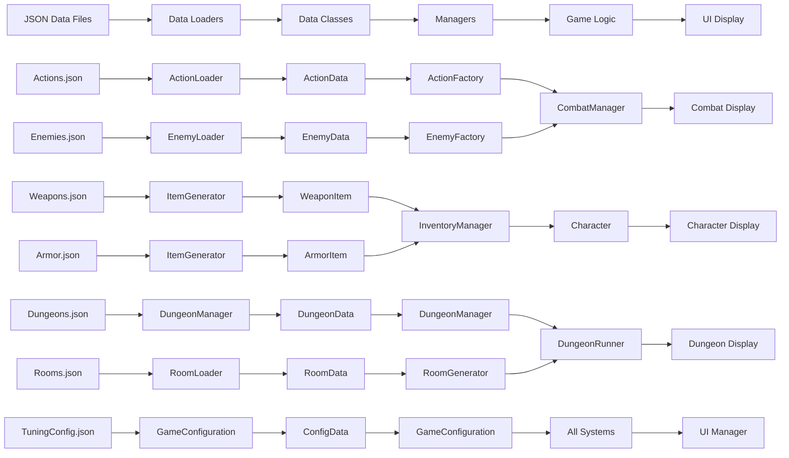

# DungeonFighter Game Logic Flowchart

This document provides a comprehensive flowchart of all game logic based on the architecture analysis.

## Complete Game Flow

## Combat System Detail

## Action System Detail

## Character System Detail

## Dungeon System Detail

## Inventory & Equipment System Detail

## Data Flow Architecture

## Key Design Patterns Used

```mermaid
flowchart TD
    A[Design Patterns] --> B[Manager Pattern]
    A --> C[Factory Pattern]
    A --> D[Strategy Pattern]
    A --> E[Registry Pattern]
    A --> F[Facade Pattern]
    A --> G[Builder Pattern]
    A --> H[Observer Pattern]
    A --> I[Composition Pattern]
    
    B --> B1[CombatManager]
    B --> B2[DungeonManager]
    B --> B3[InventoryManager]
    B --> B4[CharacterHealthManager]
    
    C --> C1[EnemyFactory]
    C --> C2[ActionFactory]
    C --> C3[ItemGenerator]
    
    D --> D1[ActionSelector]
    D --> D2[ActionExecutor]
    D --> D3[EffectHandlerRegistry]
    
    E --> E1[EffectHandlerRegistry]
    E --> E2[EnvironmentalEffectRegistry]
    
    F --> F1[CharacterFacade]
    F --> F2[GameDisplayManager]
    
    G --> G1[CharacterBuilder]
    G --> G2[EnemyBuilder]
    
    H --> H1[BattleHealthTracker]
    H --> H2[CombatResults]
    
    I --> I1[Character with Managers]
    I --> I2[CombatManager with Specialized Handlers]
```

This comprehensive flowchart shows the complete game logic flow from application startup through all major systems including combat, character management, dungeon exploration, inventory management, and data flow architecture. Each major system is broken down into its component processes, showing how the modular architecture enables clean separation of concerns while maintaining interconnected functionality.
