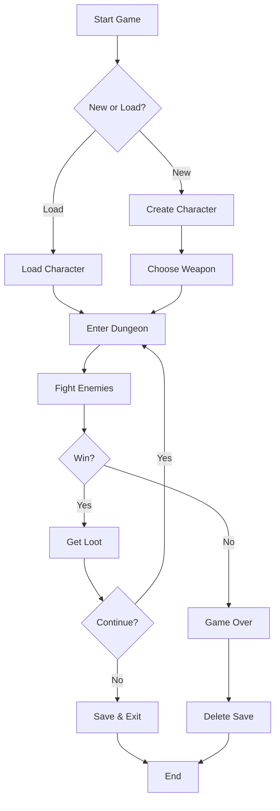
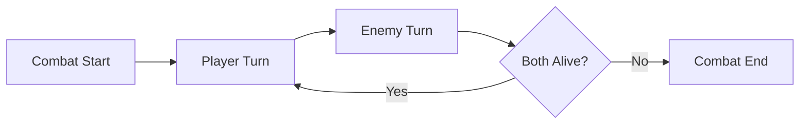
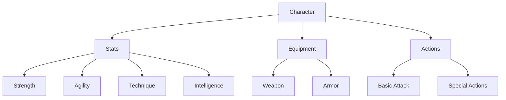

# Simple Mermaid Flowchart Example

Here's a simple example to test Mermaid rendering:

## Basic Game Flow



## Combat System



## Character Stats



## How to Use This:

1. **Copy the code** between the ```mermaid and ``` markers
2. **Go to [mermaid.live](https://mermaid.live/)**
3. **Paste the code** in the editor
4. **See the diagram** render automatically
5. **Download** as PNG, SVG, or PDF

## Tips:

- Use **TD** for Top-Down flowcharts
- Use **LR** for Left-Right flowcharts
- Use **{text}** for decision points
- Use **[text]** for process boxes
- Use **-->** for arrows
- Use **|label|** for arrow labels
