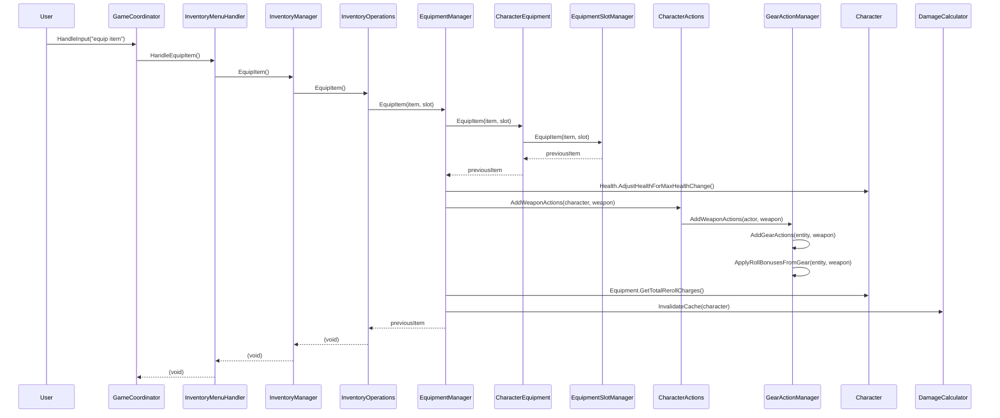
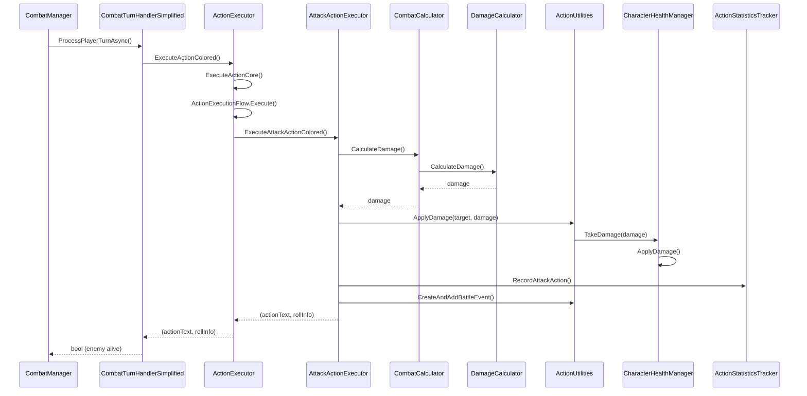
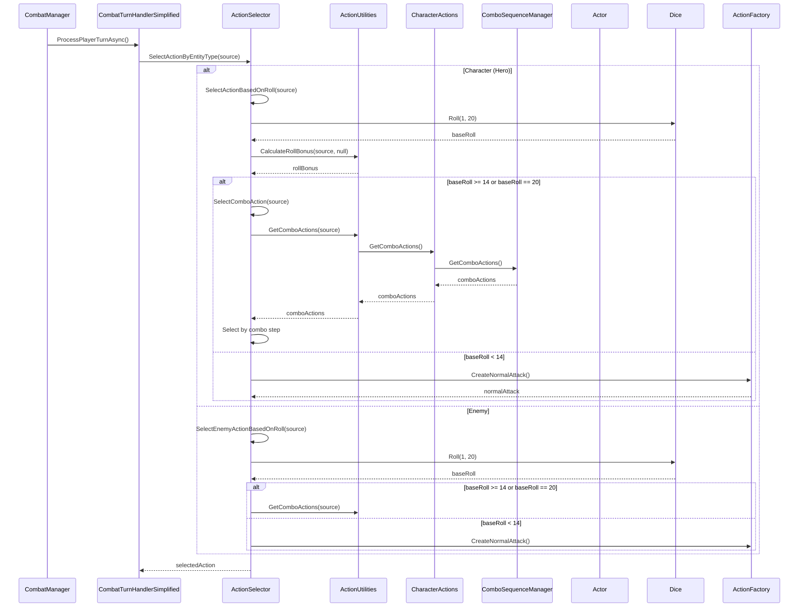
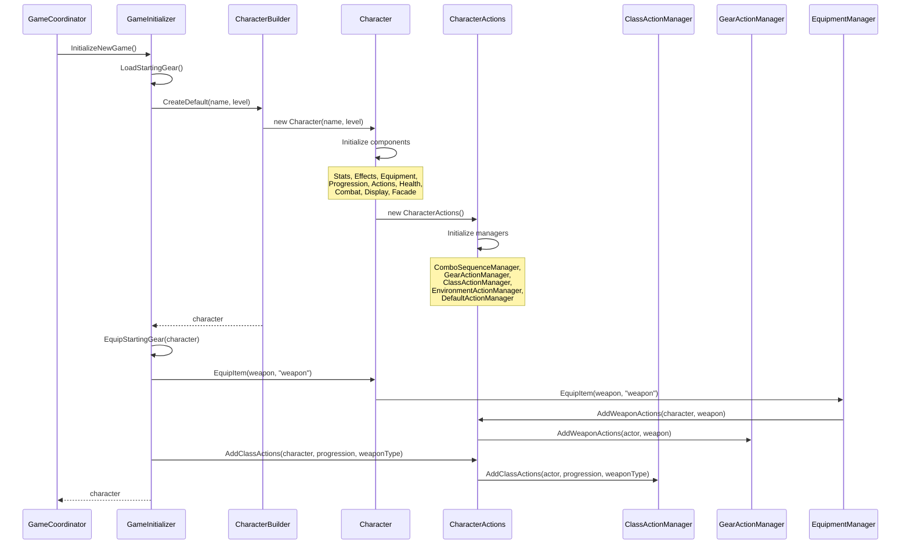

# Navigation Guide for Abstraction Layers

This guide maps the call flow paths through the abstraction layers for common operations in DungeonFighter-v2. Use this to quickly understand how to navigate the codebase when debugging, adding features, or making changes.

## Quick Reference Table

| Operation | Entry Point | Key Layers | Final Implementation | Layer Count |
|-----------|-------------|------------|---------------------|-------------|
| **Equip Item** | `GameCoordinator.HandleInput()` | GameCoordinator → InventoryMenuHandler → InventoryManager → InventoryOperations → EquipmentManager → CharacterEquipment → EquipmentSlotManager + CharacterActions → GearActionManager | `EquipmentSlotManager.EquipItem()` + `GearActionManager.AddWeaponActions()` | 7-8 |
| **Combat Attack** | `CombatManager.ProcessCombat()` | CombatManager → CombatTurnHandlerSimplified → ActionExecutor → AttackActionExecutor → CombatCalculator → DamageCalculator → ActionUtilities → Character.Health.TakeDamage() | `CharacterHealthManager.TakeDamage()` | 6-7 |
| **Action Selection** | `CombatTurnHandlerSimplified.ProcessPlayerTurnAsync()` | CombatTurnHandlerSimplified → ActionSelector → CharacterActions → Various Action Managers → Action Pool | `ActionSelector.SelectActionBasedOnRoll()` | 5-6 |
| **Character Creation** | `GameCoordinator.InitializeGame()` | GameCoordinator → GameInitializer → CharacterBuilder → Character (with managers) → CharacterActions → Action Managers | `CharacterBuilder.Build()` | 4-5 |

---

## 1. Equip Item Flow (7-8 layers)

**Priority: HIGH** - Most complex and frequently modified operation

### Visual Call Flow

### Step-by-Step Path

1. **Entry Point**: `GameCoordinator.HandleInput()` 
   - File: `Code/Game/Game.cs`
   - Routes user input to appropriate handler

2. **Inventory Menu Handler**: `InventoryMenuHandler.HandleEquipItem()`
   - File: `Code/Game/InventoryMenuHandler.cs`
   - Coordinates inventory menu operations
   - Delegates to specialized handlers

3. **Inventory Manager**: `InventoryManager.EquipItem()`
   - File: `Code/Items/InventoryManager.cs` (line 43)
   - Facade that delegates to operations

4. **Inventory Operations**: `InventoryOperations.EquipItem()`
   - File: `Code/Items/Inventory/InventoryOperations.cs` (line 25)
   - Handles user input and item selection
   - Determines slot from item type

5. **Equipment Manager**: `EquipmentManager.EquipItem(item, slot)`
   - File: `Code/Entity/EquipmentManager.cs` (line 23)
   - Orchestrates equipment change with side effects:
     - Stores health percentage before change
     - Calls CharacterEquipment.EquipItem()
     - Adjusts health for max health changes
     - Updates actions after gear change
     - Applies roll bonuses
     - Updates reroll charges
     - Invalidates damage cache

6. **Character Equipment**: `CharacterEquipment.EquipItem(item, slot)`
   - File: `Code/Entity/CharacterEquipment.cs` (line 62)
   - Facade that delegates to EquipmentSlotManager

7. **Equipment Slot Manager**: `EquipmentSlotManager.EquipItem(item, slot)`
   - File: `Code/Entity/EquipmentSlotManager.cs`
   - Actually performs the slot assignment
   - Returns previous item (if any)

8. **Character Actions**: `CharacterActions.AddWeaponActions(character, weapon)`
   - File: `Code/Entity/CharacterActions.cs` (line 62)
   - Facade that delegates to GearActionManager

9. **Gear Action Manager**: `GearActionManager.AddWeaponActions(actor, weapon)`
   - File: `Code/Entity/Managers/GearActionManager.cs` (line 16)
   - Adds weapon-specific actions to actor's action pool
   - Applies roll bonuses from gear

### Key Decision Points

- **Weapon vs Armor**: Determined by `item.Type` in `InventoryOperations.EquipItem()` (line 32-39)
- **Previous Item Handling**: `EquipmentManager` checks if previous item exists and removes its actions/bonuses
- **Health Adjustment**: Max health changes trigger proportional current health adjustment
- **Action Updates**: Weapon changes trigger combo sequence reinitialization if combo is empty

### Side Effects

1. **Health Adjustment**: If max health changes, current health is adjusted proportionally
2. **Action Pool Updates**: Previous item's actions removed, new item's actions added
3. **Roll Bonus Updates**: Bonuses from previous item removed, new item's bonuses applied
4. **Reroll Charges**: Updated from Divine modifications on equipment
5. **Damage Cache**: Invalidated since equipment affects damage calculations
6. **Combo Sequence**: May be reinitialized if weapon changed and combo is empty

### Related Files

- `Code/Entity/EquipmentSlotManager.cs` - Slot management
- `Code/Entity/Managers/GearActionManager.cs` - Gear action management
- `Code/Entity/Managers/ComboSequenceManager.cs` - Combo sequence management
- `Code/Combat/Calculators/DamageCalculator.cs` - Damage cache invalidation

---

## 2. Combat Attack Execution (6-7 layers)

**Priority: HIGH** - Core gameplay mechanic

### Visual Call Flow

### Step-by-Step Path

1. **Entry Point**: `CombatManager.ProcessCombat()` or `CombatManager.ProcessPlayerTurnAsync()`
   - File: `Code/Combat/CombatManager.cs`
   - Orchestrates combat flow

2. **Turn Handler**: `CombatTurnHandlerSimplified.ProcessPlayerTurnAsync()`
   - File: `Code/Combat/CombatTurnHandlerSimplified.cs` (line 24)
   - Handles turn processing logic
   - Checks for stun status
   - Calls action execution

3. **Action Executor**: `ActionExecutor.ExecuteActionColored()`
   - File: `Code/Actions/ActionExecutor.cs` (line 52)
   - Orchestrates action execution
   - Calls `ActionExecutionFlow.Execute()` for core logic
   - Formats results as ColoredText

4. **Attack Action Executor**: `AttackActionExecutor.ExecuteAttackActionColored()`
   - File: `Code/Actions/Execution/AttackActionExecutor.cs` (line 16)
   - Handles attack-specific execution
   - Calculates damage multiplier
   - Processes multi-hit attacks
   - Formats damage display

5. **Combat Calculator**: `CombatCalculator.CalculateDamage()`
   - File: `Code/Combat/CombatCalculator.cs`
   - Centralized damage calculation
   - Delegates to DamageCalculator

6. **Damage Calculator**: `DamageCalculator.CalculateDamage()`
   - File: `Code/Combat/Calculators/DamageCalculator.cs`
   - Performs actual damage calculation
   - Uses cached values when available
   - Applies modifiers and multipliers

7. **Action Utilities**: `ActionUtilities.ApplyDamage()`
   - File: `Code/Actions/ActionUtilities.cs`
   - Applies damage to target
   - Calls target's TakeDamage method

8. **Character Health Manager**: `CharacterHealthManager.TakeDamage()`
   - File: `Code/Entity/CharacterHealthManager.cs`
   - Final damage application
   - Updates current health
   - Triggers death check if health <= 0

### Key Decision Points

- **Action Type**: Determines if attack, heal, or other action type
- **Multi-Hit**: If `MultiHitCount > 1`, processes multiple hits in loop
- **Critical Hit**: Natural 20 or total roll >= 20 triggers critical
- **Hit/Miss**: Roll vs target's defense determines hit
- **Stun Check**: Stunned entities skip action execution

### Side Effects

1. **Damage Application**: Target's health reduced
2. **Status Effects**: Applied if action causes them (bleed, burn, etc.)
3. **Statistics Tracking**: Action recorded in character stats
4. **Battle Events**: Event added to battle narrative
5. **Combo Step**: Incremented if combo action used
6. **Roll Penalties**: Enemy roll penalties applied if action has them

### Related Files

- `Code/Actions/Execution/ActionExecutionFlow.cs` - Core execution flow
- `Code/Actions/Execution/ActionStatisticsTracker.cs` - Statistics tracking
- `Code/Combat/CombatResults.cs` - Result formatting
- `Code/Combat/BattleNarrative.cs` - Battle event tracking

---

## 3. Action Selection in Combat (5-6 layers)

**Priority: MEDIUM** - Important for understanding combat flow

### Visual Call Flow

### Step-by-Step Path

1. **Entry Point**: `CombatTurnHandlerSimplified.ProcessPlayerTurnAsync()`
   - File: `Code/Combat/CombatTurnHandlerSimplified.cs` (line 24)
   - Processes player turn
   - Calls action selection

2. **Action Selector**: `ActionSelector.SelectActionByEntityType(source)`
   - File: `Code/Actions/ActionSelector.cs` (line 22)
   - Routes to character or enemy selection logic
   - Character path: `SelectActionBasedOnRoll()`
   - Enemy path: `SelectEnemyActionBasedOnRoll()`

3. **Roll-Based Selection**: `ActionSelector.SelectActionBasedOnRoll(source)`
   - File: `Code/Actions/ActionSelector.cs` (line 45)
   - Rolls 1d20 for base roll
   - Calculates roll bonus
   - Determines action type based on base roll:
     - **14-20**: Combo action
     - **6-13**: Normal attack
     - **<6**: Normal attack

4. **Combo Action Selection**: `ActionSelector.SelectComboAction(source)`
   - File: `Code/Actions/ActionSelector.cs` (line 131)
   - Gets combo actions from actor
   - Selects by combo step (cycling through combo)

5. **Action Utilities**: `ActionUtilities.GetComboActions(source)`
   - File: `Code/Actions/ActionUtilities.cs`
   - Retrieves combo actions from actor's action pool
   - Filters for `IsComboAction == true`

6. **Character Actions**: `CharacterActions.GetComboActions()`
   - File: `Code/Entity/CharacterActions.cs` (line 35)
   - Delegates to ComboSequenceManager

7. **Combo Sequence Manager**: `ComboSequenceManager.GetComboActions()`
   - File: `Code/Entity/Managers/ComboSequenceManager.cs`
   - Returns the combo sequence list
   - Manages combo ordering

### Key Decision Points

- **Entity Type**: Character vs Enemy determines selection strategy
- **Base Roll**: Natural roll (1-20) determines action type, not total roll with bonuses
- **Roll Thresholds**:
  - **20**: Natural 20 = always combo + critical
  - **14-19**: Combo action range
  - **6-13**: Normal attack range
  - **<6**: Normal attack range
- **Stun Check**: Stunned entities return null (no action)
- **Combo Step**: Used to cycle through combo actions

### Side Effects

1. **Roll Storage**: Base roll stored for use in execution phase
2. **Combo Step**: Incremented when combo action selected
3. **Action Pool Access**: Reads from actor's action pool

### Related Files

- `Code/Actions/ActionFactory.cs` - Creates normal attack actions
- `Code/Entity/Managers/ComboSequenceManager.cs` - Combo sequence management
- `Code/Utils/Dice.cs` - Dice rolling utilities

---

## 4. Character Creation/Initialization (4-5 layers)

**Priority: MEDIUM** - Important for game startup

### Visual Call Flow

### Step-by-Step Path

1. **Entry Point**: `GameCoordinator.InitializeGame()` or `GameInitializer.InitializeNewGame()`
   - File: `Code/Game/GameInitializer.cs` (line 98)
   - Orchestrates game initialization

2. **Game Initializer**: `GameInitializer.InitializeNewGame()`
   - File: `Code/Game/GameInitializer.cs` (line 98)
   - Loads starting gear data
   - Creates character using builder
   - Equips starting gear
   - Initializes class actions

3. **Character Builder**: `CharacterBuilder.CreateDefault(name, level)`
   - File: `Code/Entity/CharacterBuilder.cs` (line 51)
   - Builder pattern for character creation
   - Creates Character instance with default settings

4. **Character Constructor**: `Character(string? name, int level)`
   - File: `Code/Entity/Character.cs` (line 54)
   - Initializes all components:
     - `CharacterStats` - Statistics and leveling
     - `CharacterEffects` - Effects and buffs/debuffs
     - `CharacterEquipment` - Equipment management
     - `CharacterProgression` - Experience and progression
     - `CharacterActions` - Action management (facade)
     - `CharacterHealthManager` - Health management
     - `CharacterCombatCalculator` - Combat calculations
     - `GameDisplayManager` - Display management
     - `EquipmentManager` - Equipment operations
     - `LevelUpManager` - Level up logic
     - `CharacterFacade` - Simplified interface

5. **Character Actions Initialization**: `CharacterActions()` constructor
   - File: `Code/Entity/CharacterActions.cs` (line 24)
   - Initializes specialized managers:
     - `ComboSequenceManager` - Combo sequences
     - `GearActionManager` - Gear actions
     - `ClassActionManager` - Class actions
     - `EnvironmentActionManager` - Environment actions
     - `DefaultActionManager` - Default actions

6. **Starting Gear Equip**: `GameInitializer.EquipStartingGear(character)`
   - File: `Code/Game/GameInitializer.cs`
   - Equips starting weapon and armor
   - Triggers action addition via EquipmentManager

7. **Class Actions**: `CharacterActions.AddClassActions(character, progression, weaponType)`
   - File: `Code/Entity/CharacterActions.cs` (line 94)
   - Adds class-specific actions based on character class
   - Delegates to ClassActionManager

### Key Decision Points

- **Character Class**: Determines which class actions are added
- **Weapon Type**: Affects available class actions
- **Starting Gear**: Loaded from `GameData/StartingGear.json` or `TuningConfig.json`
- **Level**: Affects base stats and available actions

### Side Effects

1. **Action Pool Population**: Starting weapon actions and class actions added
2. **Combo Sequence**: Default combo initialized if weapon equipped
3. **Stats Initialization**: Base stats calculated from level
4. **Health Initialization**: Max health calculated from level and config

### Related Files

- `Code/Entity/CharacterBuilder.cs` - Character construction
- `Code/Entity/Managers/ClassActionManager.cs` - Class action management
- `GameData/StartingGear.json` - Starting gear definitions
- `Code/Config/CharacterConfig.cs` - Character configuration

---

## Future Improvements (Analysis Only)

This section identifies potential simplification opportunities without implementing changes.

### Pure Pass-Through Facades

These facades only delegate without adding logic:

1. **CharacterEquipment** → **EquipmentSlotManager**
   - Many methods are direct pass-throughs (e.g., `EquipItem`, `UnequipItem`)
   - **Consideration**: Could potentially be simplified, but facade provides unified interface for multiple managers

2. **CharacterActions** → **Specialized Managers**
   - Most methods are direct delegation
   - **Consideration**: Facade provides backward compatibility and clean API, worth keeping

### Potential Consolidation Opportunities

1. **InventoryManager** → **InventoryOperations**
   - InventoryManager is thin facade
   - **Consideration**: Could merge, but separation allows independent testing

2. **ActionExecutor** → **ActionExecutionFlow**
   - ActionExecutor mostly formats results
   - **Consideration**: Separation allows different output formats (string vs ColoredText)

### Recommendations

- **Keep current architecture**: The abstraction layers provide clear separation of concerns
- **Documentation is key**: This guide addresses the main pain point (navigation)
- **Consider IDE bookmarks**: For frequently accessed files in each flow
- **Add call flow comments**: In complex methods, add comments showing next layer

---

## Related Documentation

- [Architecture Overview](../01-Core/ARCHITECTURE.md) - Complete system architecture
- [Quick Reference](./QUICK_REFERENCE.md) - Key file locations and classes
- [Code Patterns](../02-Development/CODE_PATTERNS.md) - Design patterns used
- [Development Workflow](../02-Development/DEVELOPMENT_WORKFLOW.md) - Development process

---

## Tips for Navigation

1. **Start from Entry Points**: Always begin tracing from the entry point listed in the Quick Reference Table
2. **Follow the Sequence Diagrams**: Use the Mermaid diagrams to visualize the flow
3. **Check Side Effects**: Be aware of side effects listed for each operation
4. **Use IDE "Go to Definition"**: Follow method calls through the layers
5. **Check Related Files**: Review related files section for context

---

*Last Updated: 2025-01-27*

