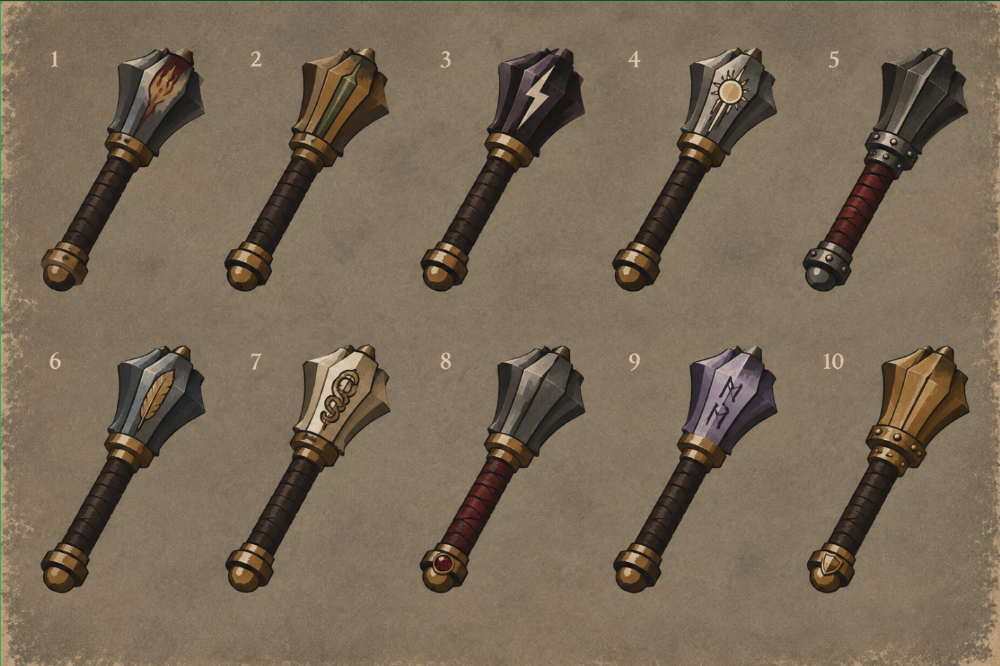

# Dungeon Fighter — sculpted, hand-painted dark fantasy

Updated September 22, 2026. This is the rendering target for every equipment and consumable family. It supersedes the earlier flat-only direction, including instructions to flatten volume, omit contact shadows, or prohibit gradients. This revision documents the target; existing catalog art still needs to be evaluated against it.

## Primary reference

The user's ten-mace sheet is the primary reference for construction, lighting, paint handling, and material depth. Earlier studies remain useful for mood but do not override this sheet. Transfer its rendering language to each object's actual construction; armor and garments should not inherit mace geometry. The following is a visual analysis, not a claim about the reference artist's software or painting process.

## What makes the reference work

- **Weight and thickness:** the heads have projecting flanges, recessed faces, visible side planes and thick collars. Pommel caps feel rounded. Nothing is just a colored silhouette with a border.
- **Connected construction:** collars enclose shafts, wrap turns overlap, rivets sit in bands, and sockets disappear behind the head. Dark contact shadows explain how parts fit together.
- **Designed value masses:** pale upper-facing bevels sit next to broad middle values and deep charcoal sides. The head attracts attention; the grip stays quieter.
- **Painted transitions:** broad facets establish volume, with restrained gradients and irregular tonal patches inside them. Highlights vary in width and break at changes of plane. The result has depth without an airbrushed or polished-plastic finish.
- **Material contrast:** dark leather wraps, warm metal collars, cool or colored head surfaces, and small pale accents remain distinct. Material variants preserve the same coherent lighting.
- **Integrated symbols:** motifs follow the head's angle and surface. Insets and raised fittings have a little thickness, a lit edge, and a shadow edge. They belong to the object.
- **Controlled repetition:** the ten studies share a base design and pose to expose material and ornament differences. This is a variant comparison, not a reason to give every named base item the same silhouette.

The parchment ground, numbers, and worn border belong to the presentation. They must not be baked into isolated item art or used to compensate for weak rendering.

## 1. Silhouette and construction

Design a recognizable object before adding finish. Check the solid silhouette at inventory size. Establish its main mass, supporting structure, functional connections, and a few distinctive proportions.

Use broad curves for fabric, formed leather, organic objects, and rounded fittings; use deliberate angular planes for forged or carved edges. Organic does not mean inflating every contour or making both legs wavy. Garment curves should follow seams, gravity, bending joints, and the tension of fastenings.

Show thickness at selected rims, cuffs, sockets, blade spines, pages, and plate overlaps. Use a modest three-quarter view where it reveals construction. Paired armor can face forward with subtle outward orientation. Keep proportions practical and negative spaces open. Avoid paddle-like blades, swollen thighs, identical rectangular hanging plates, wire-thin chains, and ornaments that float above their attachment.

## 2. Light and value

Use a shared upper-left key light in image space. Mirroring geometry must not reverse the lighting on a paired item.

Build each major component with four useful value roles: deep occlusion, shadow side, local-color face, and selective lit plane. A small brightest accent is optional. Large dark areas are essential; do not lift every shadow to gray or trace every edge with a bright line.

Allow restrained gradients **within a specific plane or curved surface**. Separate adjacent faces with deliberate value changes. A single diagonal gradient across the whole silhouette cannot describe a head, a collar, a wrap, and a gem at once.

Use tight, painted contact shadows beneath collars, cloth turns, plate overlaps, clasps, and insets. Favor broken pale bevels and short reflected accents over continuous rims. Avoid bloom, glassy specular streaks on every material, studio spotlights, and heavy blurred drop shadows behind the whole item.

## 3. Palette and material response

Keep colors subdued but preserve enough value range for depth. These are starting swatches, not measured samples from the reference: charcoal `#211F20`, slate `#555653`, ivory `#C5BBA4`, ochre `#92703B`, oxblood `#672B2E`, umber `#4D382E`, cool shadow `#353947`, neutral ground `#918572`.

| Material | Form, light, and surface treatment |
| --- | --- |
| Steel / iron / silver | Broad dark faces, pale bevels, restrained face gradients, occasional uneven brushed marks. Silver has lighter accents; iron stays duller. |
| Bronze / gold | Warm ochre middle values, brown shadow, small cream highlights on raised edges; avoid yellow plastic. |
| Leather | Rounded overlapping wraps or formed panels, dark tucked edges, broad soft highlights, sparse tonal mottling. |
| Cloth | Soft planar folds originating at seams and tension points; quieter highlights than metal, subtle broad pigment variation. Preserve a fabric silhouette even with metal trim. |
| Wood | Tapered grain direction suggested by a few long painted strokes; dark sockets and restrained rounded highlights. |
| Bone / stone | Carved volume, warm or cool shadow pockets, broken broad facets and small irregular color patches. |
| Gems / crystal / glass | A few purposeful facets or translucent-looking painted planes, dark settings, tiny bright accents; no sparkle spray or optical simulation. |
| Magical materials | Muted unusual hues with the same physical value structure. Color alone does not create emission. |

## 4. Edges, brushwork, and wear

Use selective dark contours: heavier on shadow-side boundaries and deep joins, thinner or interrupted on lit edges. Interior boundaries should often be value changes rather than black outlines. Avoid a uniform cartoon stroke around every rivet and fold.

Paint texture in clusters of irregular patches and short marks. Let their direction and placement follow the surface. Mix a few visible broad marks with quieter areas; uniform tiny random speckles do not reproduce the reference's brushwork. Keep the silhouette and focal highlights legible when reduced.

Separate three things:

1. **Paint handling:** gradients, brush patches, and edge variation that are always part of the clean illustration.
2. **Physical workmanship or wear:** restrained repairs, rubbed corners, or construction differences when called for by the item recipe.
3. **Optional print distress:** pigment dropout across the final image, independent of material, quality, and physical depth.

The artwork must look finished with print distress disabled. Never use erased pixels or background grain as the primary surface treatment.

## 5. Translate the reference across families

| Family | Required construction cues |
| --- | --- |
| Swords / daggers | Distinct blade profile, readable spine or bevel, credible tang-to-guard junction, wrapped grip and dimensional pommel. Curvature must describe a functional cutting form. |
| Maces / flails | Weighted heads with separated striking planes; enclosing collars and grips. Flails need visible connected links and a convincing attachment at both ends. |
| Wands / focuses | Tapered carved shafts, fitted sockets and insets. Books need page blocks and cover thickness; idols need carved facial/body masses; obelisks need distinct faces and a supporting base. |
| Headwear | Crown volume, dark opening, rim thickness, overlapping cheek or neck pieces. Hoods drape around an opening; helmets enclose a head rather than reading as flat badges. |
| Body armor | Chest and shoulder volume, layered panels, visible openings and plausible straps. Fabric folds and metal planes have different light responses. |
| Breeches / trousers | Tailored waist, defined crotch, controlled thigh volume, seam-driven folds and believable hems. Distinguish cut and length; do not substitute inflated hips or arbitrary contour waves for cloth. |
| Tassets / leg armor | Suspended panels that curve around thighs, visible attachment straps, overlapping plates with thickness and a natural outward flare. Greaves follow shin and calf; knees articulate. |
| Wraps / footwear | Wrap turns conform to a changing limb section. Boots have toe, vamp, heel and sole depth; cuffs and bindings compress or overlap the underlying form. |
| Charms | A dimensional setting, inset motif, attached bail and cord. Keep the central mass readable; avoid flat shield stickers on thin loops. |
| Consumables | Convincing vessel, food or bundle volume; thick rims, closures and overlap shadows. Preserve recognizable purpose and distinctive base colors. |

## 6. Affixes and variants

Keep the established ownership: base item controls construction; material controls appropriate surfaces and fittings; quality controls bindings and workmanship; prefix controls construction accents or its assigned crest; suffix controls its separate motif or fitting.

The reference supports restrained colored inlays and relief motifs as style examples. It does not, by itself, change current affix mappings or authorize new emission. Follow AFFIX-VISUAL-RULES.md for semantics. Make every attached ornament share the host's perspective, light, thickness, and contact shadow. Rarity increases neither gloss nor noise automatically.

## 7. Implementation and review

For the existing SVG renderer, prefer dedicated silhouette paths, explicit side/bevel faces, component-local gradients, and fitted overlap shadows. Add deterministic clipped brush patches sparingly. Keep affix anchors on the redesigned geometry. Do not mirror finished lighting, stretch ornaments across curved hosts, or apply one generic finish as a substitute for modeled construction.

Review in this order:

1. Solid silhouette: does the base read immediately, and does its construction differ meaningfully from neighboring bases?
2. Plain shaded item: do weight, thickness, overlaps, and material read without any emblem or distress?
3. Grayscale: is there one clear focal mass, a substantial shadow side, and selective highlights?
4. Surface pass: do painterly transitions enrich the volume rather than obscure it?
5. Variant sheet: compare plain, material-only, prefix-only, suffix-only, and combined versions at the same scale and angle.
6. Inventory size and enlarged: check clarity, clipping, disconnected parts, repeated texture, mirrored lighting, and overcrowded ornaments.

Use the mace sheet beside the review. A pass is successful when the object has comparable weight, material separation, painted edge control, and restrained detail—not simply more curves, gradients, rivets, or noise. Renderer tests verify recipe compatibility; visual review determines whether the art meets this guide.

## 8. Reusable art brief

> Create [ITEM] using the attached ten-mace sheet as the primary rendering reference. Restrained, hand-painted dark fantasy with convincing sculpted volume, grounded proportions, thick overlapping construction, selective irregular contours, and a muted palette. Use a consistent upper-left key, broad dark sides, component-specific painted gradients, broken pale bevels, and tight contact shadows. Add economical irregular brush patches that follow material and form. [DESIGN, MATERIAL, QUALITY, PREFIX, SUFFIX]. Preserve each material's distinct response and integrate motifs into actual fittings. Keep the full silhouette comfortably padded on [TRANSPARENT / NEUTRAL GROUND]. Deliver the clean painting without baked-in paper, labels, border, or print distress. Avoid flat clipart, ballooned cloth, uniform black outlines, all-over bevel shine, airbrushed plastic, photorealism, neon bloom, and dense procedural noise.
