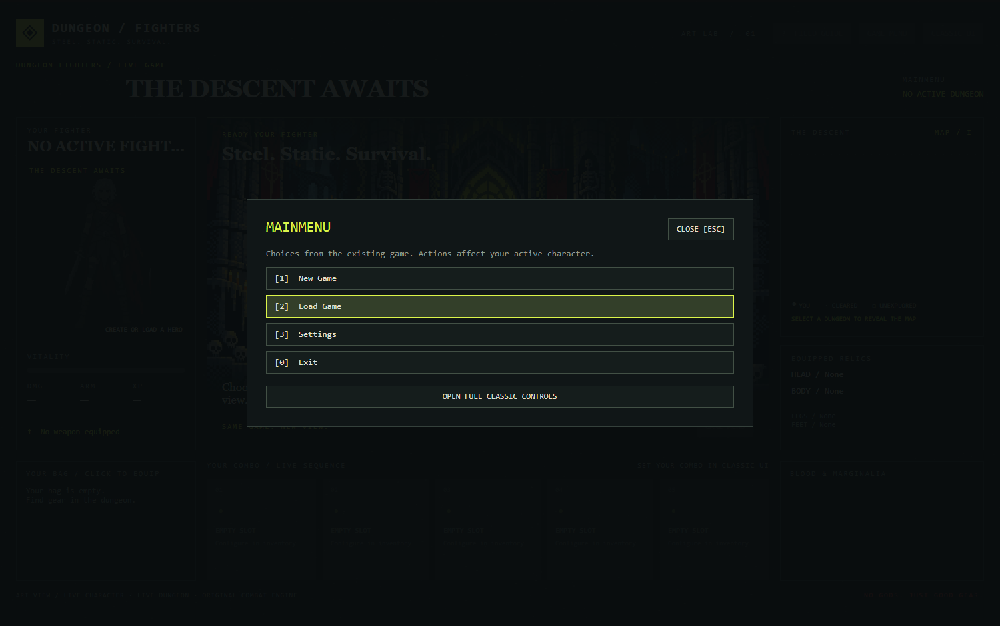

# Dungeon Fighters — native pixel-art view



The approved chunky cathedral pixel art, acid-yellow wayfinding, blood-red accents, equipment-aware fighter, and compact room map now present the **existing game backend**. There is no parallel combat simulation or fixed demonstration dungeon.

## Launch and play

- Windows: `Dungeon Fighter Art Lab.bat` builds and launches the regular game with the art view open.
- Other supported desktops: `dotnet run --project Code -- ART`.
- In the rebuilt regular game, **F9** opens/restores the art view for that exact live session.
- **Game Menu** exposes existing backend choices for starting a character, selecting starter gear, entering dungeons, and continuing after a run.
- **Classic UI** returns to the original interface for full character management, settings, detailed inventory, and combo editing. **F9** returns to the art view.
- Combat runs automatically using the player's actual combo. At the normal between-room prompt, click the next map room or press **Space**. **Leave Dungeon** invokes the existing exit handler.
- The map uses `Dungeon.Rooms` in their actual sequential order, visually folded into rows. Large dungeons paginate automatically around the current room. There are no invented branches, teleportation, or room replay rewards.
- Clicking an equipment item in the real bag uses `InventoryItemActionHandler.ConfirmEquipItem`, including attribute requirements, slot handling, action rebuilding, and returning replaced items to inventory. Equipment is locked during runs. Consumables stay in the existing inventory flow.
- **F1** opens the guide; **Escape** closes an overlay.

Actions affect the real active character and normal saves. Closing the art window leaves the classic game running. Closing the classic main window exits normally.

## Backend reuse

`MainWindow.OpenArtViewWhenReady` passes its existing `GameCoordinator` and `CanvasUICoordinator` into `ArtLabWindow`; opening the art view never constructs another coordinator or clones a hero.

`ArtLabSession` is a presentation adapter, not an alternate game engine:

- Character, health, XP, equipment, combo and inventory come from the current `GameStateManager` character.
- Dungeon and rooms come from `GameCoordinator.CurrentDungeon` and `CurrentRoom`.
- Enemy and combat output come from the existing canvas coordinator.
- Main menu commands go through `GameCoordinator.HandleInput`.
- Map advancement and leaving use `DungeonExitChoiceHandler`'s existing pending choice.
- Gear uses the production inventory/equipment handlers.
- Production `DungeonOrchestrator`, `RoomProcessor`, `CombatManager`, search, loot, progression, and save behavior are unchanged.

The native view samples the live state on the Avalonia dispatcher every 150 ms. It rebuilds dynamic controls only when their content changes and stops the timer on close. Shared menu choices reuse `AgentChoiceBuilder`; advanced screens remain available through Classic UI.

## Current art limits

One shared cathedral illustration is used across rooms. Live names, narrative, route position, enemy health, combo, gear, and journal change with the game. Per-enemy and per-room art are future asset work. Three portrait families approximate weapon/armor appearance; they do not yet depict every catalog item exactly. Exact equipment names and stats always come from the backend.

The layout uses a 1500×940 design surface scaled uniformly, with a 1050×680 minimum window. It is a desktop exploration; a dedicated narrow/mobile composition is not included.

## Files and validation

- `Code/UI/Avalonia/ArtLab/ArtLabWindow.axaml`: native UI and styling.
- `ArtLabWindow.axaml.cs`: presentation, control wiring, and view refresh.
- `ArtLabSession.cs`: live backend adapter.
- `ArtLabArtwork.cs`: source-rectangle portrait drawing, map links, print flecks.
- `Code/UI/Avalonia/Assets/ArtLab/`: embedded generated art.
- `Code/Tests/Unit/ArtLabSessionTests.cs`: real-backend integration checks (shared references, equipment requirements and item preservation, room order, continue/leave gates, character switching).

```powershell
dotnet build Code/Code.csproj --no-restore -o Code/bin/Art/net8.0 -p:KeepRunningInstance=true
dotnet Code/bin/Art/net8.0/DF.dll ARTTEST
```

The standard-depth output path preserves the existing settings/data resolver. `KeepRunningInstance=true` skips the repository's normal pre-build termination of all DF processes. Close this art build before rebuilding it.

`DF.exe ART --capture <absolute-png-path>` captures the native art window after startup. Generated assets use built-in imagegen; their final prompts and repository paths are in [PROMPTS.md](PROMPTS.md).
